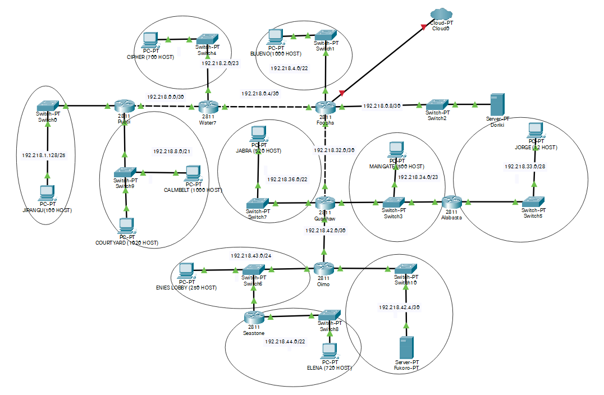
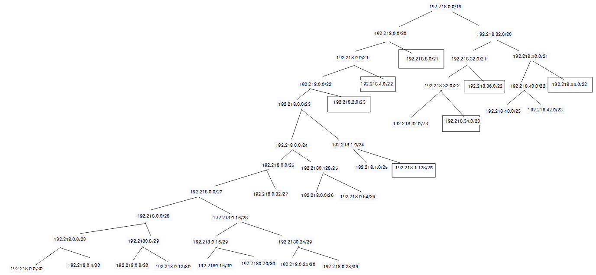

# Jarkom-Modul-4-T14-2021

Anggota Kelompok :
- Dida Prasetyo Rahmat - 05311940000019 
- Revina Rahmanisa Harjanto - 05311940000046 

--- 

## Soal


Soal shift dikerjakan pada Cisco Packet Tracer dan GNS3 menggunakan metode perhitungan CLASSLESS yang berbeda.

Keterangan: Bila di CPT menggunakan VLSM, maka di GNS3 menggunakan CIDR atau Sebaliknya

# VLSM(Cisco Packet Tracer)

### Topologi



### Network Address
<hr />

**FOOSHA**

```
192.218.1.128/25 via 192.218.0.5
192.218.2.0/23 via 192.218.0.5
192.218.8.0/21 via 192.218.0.5
192.218.33.0/25 via 192.218.32.2
192.218.34.0/23 via 192.218.32.2
192.218.36.0/22 via 192.218.32.2
192.218.42.4/30 via 192.218.32.2
192.218.43.0/24 via 192.218.32.2
192.218.44.0/22 via 192.218.32.2
```

**WATER7**

```
192.218.0.8/30 via 192.218.0.6
192.218.1.128/25 via 192.218.0.1
192.218.4.0/22 via 192.218.0.6
192.218.8.0/21 via 192.218.0.1
192.218.33.0/28 via 192.218.0.6
192.218.34.0/23 via 192.218.0.6
192.218.36.0/22 via 192.218.0.6
192.218.42.4/30 via 192.218.0.6
192.218.43.0/24 via 192.218.0.6
192.218.44.0/22 via 192.218.0.6
```

**PUCCI**

```
192.218.0.8/30 via 192.218.0.2
192.218.2.0/23 via 192.218.0.2
192.218.4.0/22 via 192.218.0.2
192.218.33.0/28 via 192.218.0.2
192.218.34.0/23 via 192.218.0.2
192.218.36.0/22 via 192.218.0.2
192.218.42.4/30 via 192.218.0.2
192.218.43.0/24 via 192.218.0.2
192.218.44.0/22 via 192.218.0.2
```

**GUANHAO**

```
192.218.0.8/30 via 192.218.32.1
192.218.1.128/25 via 192.218.32.1
192.218.2.0/23 via 192.218.32.1
192.218.4.0/22 via 192.218.32.1
192.218.8.0/21 via 192.218.32.1
192.218.33.0/28 via 192.218.34.2
192.218.42.4/30 via 192.218.42.2
192.218.43.0/24 via 192.218.42.2
192.218.44.0/22 via 192.218.42.2
```

**SEASTONE**

```
192.218.0.8/30 via 192.218.43.1
192.218.1.128/25 via 192.218.43.1
192.218.2.0/23 via 192.218.43.1
192.218.4.0/22 via 192.218.43.1
192.218.8.0/21 via 192.218.43.1
192.218.33.0/28 via 192.218.43.1
192.218.34.0/23 via 192.218.43.1
192.218.36.0/22 via 192.218.43.1
192.218.42.4/30 via 192.218.43.1
```

**OIIMO**

```
192.218.0.8/30 via 192.218.42.1
192.218.1.128/25 via 192.218.42.1
192.218.2.0/23 via 192.218.42.1
192.218.4.0/22 via 192.218.42.1
192.218.8.0/21 via 192.218.42.1
192.218.33.0/28 via 192.218.42.1
192.218.34.0/23 via 192.218.42.1
192.218.36.0/22 via 192.218.42.1
```

**ALABASTA**

```
192.218.0.8/30 via 192.218.34.1
192.218.1.128/25 via 192.218.34.1
192.218.2.0/23 via 192.218.34.1
192.218.4.0/22 via 192.218.34.1
192.218.8.0/21 via 192.218.34.1
192.218.36.0/22 via 192.218.34.1
192.218.42.4/30 via 192.218.34.1
192.218.43.0/24 via 192.218.34.1
192.218.44.0/22 via 192.218.34.1
```

## Pohon Pembagian IP



# CIDR (GNS3)

Mohon maaf belum dapat diselesaikan


